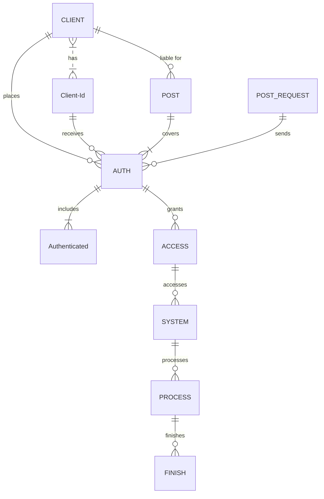

<!-- EN -->

------------------------------  
  
## The first in world Stake prediction

https://github.com/uhhlw2/z2/assets/170807472/7ff10f64-e88a-49aa-b32a-00b0d3d86f9a

## Installation
1. Open main.py
2. If main.py not work, open stakepredict.exe

<!-- ROADMAP -->
## Roadmap

- [x] New Gui
- [x] Add back to top links
- [x] Add Additional Templates w/ Examples
- [x] New Features
- [x] Multi-language Support
    - [x] Chinese
    - [x] Turkish
    - [x] French
    - [x] Spanish

<!-- GETTING STARTED -->

